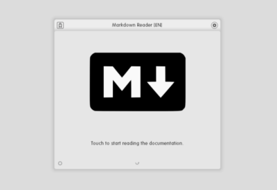
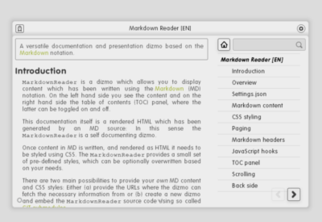
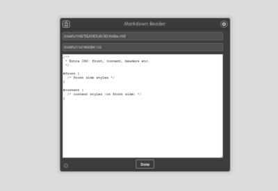

# MarkdownReader

**Table of contents**

1. Screenshots
2. Description
3. What is new in vX.Y.Z
4. Works well with
5. Additional information

## Screenshots

Add your screenshots measuring 400 times 275 pixes that illustrate your dizmo.

## Description

`MarkdownReader` is a dizmo which allows you to display content which has been written using the [Markdown][1] (MD) notation. On the left hand side you see the content and on the right hand side the table of contents (TOC) panel, where the latter can be toggled on and off.

This documentation itself is a rendered HTML which has been generated by an MD source: In this sense the `MarkdownReader` is a self documenting dizmo.

Once content in MD is written, and rendered as HTML it needs to be styled using CSS. The `MarkdownReader` provides a small set of pre-defined styles, which can be optionally overwritten based on your needs.

There are two main possibilities to provide your *own* MD content and CSS styles: Either (a) provide the URLs where the dizmo can fetch the necessary information from or (b) create a new dizmo and embed the `MarkdownReader` source code using so called [GIT submodules][2].

Option (a) is the easier approach, but option (b) offers a broader range of possibilities to customize your own `MarkdownReader` based dizmo: E.g. you can provide the dizmo with icons and its own title for re-branding purposes, or you can directly embed *assets* (like configuration, content, styles and images) to eliminate network dependency.

## What is new in v2.0.43

* added documentation

## Works well with

Standalone dizmo.

## Additional Information

* Developer: (Developers Name)
* Publisher: (Publisher's Name, remove if same as Developer)
* Contact: (Who to contact for additional information or support)
* Website: (URL of the dizmo providing additional information)

